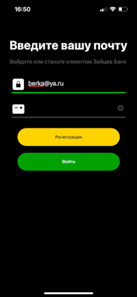
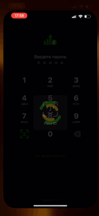
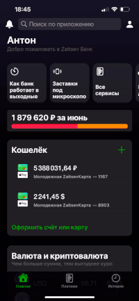
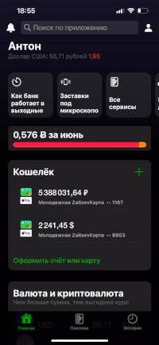

#  ZaitsevBank

Банк с предоставлением услуг по Криптовалюте

   

## Технический раздел
- [x] Поиск по валютам
- [x] Создание графиков изменение валюты
- [x] Создание уникальных карт для транзакций
- [x] Открытые транзакции
- [x] Сканирование физических карт
- [x] Переводы любых валют на счета с разными валютами без
                     необходимости перевода валют, как отдельного этапа
- [x] Требуемая память на мобильном устройстве не более 150 МБ
- [x] Требования к интернету: от 120,8 Мбит/с на отдачу
- [x] Зашифрованный поток данных

## Функции банка

- [Регистрация](#регистрация)
- [Вход в аккаунт банка](#вход-в-аккаунт-банка)
- [Главное меню](#главное-меню)
- [Выбор новой карты](#выбор-новой-карты)
- [Котировки валют](#котировки-валют)
- [Покупка или Продажа валюты](#покупка-или-продажа-валюты)
- [Перевод клиенту ZaitsevBank](#перевод-клиенту-zaitsevBank)

### Регистрация
Необходимый ввод личных данных для использования банка.

  

### Вход в аккаунт банка
Приложение предлогает ввести новый локальный PIN-CODE для входа по нему или по биометрическим данным, которые автоматически вводят PIN-CODE при успешной аутентификации пользователя. Локальный пароль шифруется AES шифрованием, в локальной базе данных находиться ключ, который видим только приложению, по нему и расшифровываются все данные о сохранённом пользователе. Ключ для каждого клиента уникален, расшифровать данные без него не получиться. 

  
  

### Главное меню
"Главная" – представлена основная информация о счетах, валютах, количество потраченных денег, а также быстрое меню для оформления счетов или просмотра всех валют в банке. "Платежи" – представляет из себя все основные функции банка от переводов клиенту банка до оплаты кредитов, так же содержит быстрое меню для выбора операций, могут которые пополняться, если пользователь будет сохранять шаблоны операций. "История" – представляет пользователю все его транзакции, которые удобно отсортированы в группы по датам, так же представлено быстрое меню для дополнительных параметров сортировки.

  

### Выбор новой карты
Пользователю доступны три варианта карт, они в данный момент отличаются только дизайном, в будущем они будут давать свои преференции для пользователя со стороны банка. На любой из карт можно выбрать абсолютно любую валюту, которую будет обрабатывать счет, от обычных валют до крипто – валют, так же можно посмотреть, как будет она выглядеть в интерфейсе банка, с лицевой стороны и с обратной. После того, как оформим новую карту, в истории транзакций появиться новая транзакция об активации новой карты с ее уникальным счетом.

  

### Котировки валют
Если клиенту необходимо посмотреть котировки валют, то для этого в приложении на странице Главная или в Платежах есть соответствующие функции. Для пользователя предоставляются котировки всех имеющих валют в мире, так же для них строиться график их изменений за неделю по дате и цене. Чтобы добиться очень быстрой загрузки и отображения, приложение исполняет запросы на каждую валюту параллельно, выполняя задачи для всех валют. Задача состоит в получении данных о валюте и получение значений для отображения его графика, после создания всех задач для всех валют в списке, созданные операции по получению данных для таблицы выполняются параллельно, тем самым ускоряя процесс из 30 секунд для последовательного получения в 2.5 секунды параллельного. Клиент может отследить как изменялась валюта в течении времени, которого он может выбрать сам: Год, полгода, квартал, месяц.

  

### Покупка или Продажа валюты
На основе выбранной валюты клиент может продать ее или купить. Если у пользователя нет карты под имеющую валюту, то приложение предложит ему создать карту под валюту, которую он хочет купить или продать (Рисунок 31). Если у клиента есть счета для покупки или продажи, то ему предложат автоматически счет, под который будут списываться или зачисляться переведенная валюта в соответствии текущего курса.

  

### Перевод клиенту ZaitsevBank
Приложение умеет переводить ваши деньги на карты банка без комиссии с обычной валюты на крипто кошелек (крипто карту) таким же быстрым способом, как и обычные. Так же серверная часть автоматически решает конфликт привязанных карт, если у них валюты разные, то приложение сообщит об этом, иначе приложение подберет карту клиента с той же валютой с которой вы списываете средства.

  
  
  

## Used in the project:

* Swift

* UIKit

* ZaitsevBankAPI

* RNCryptor - CryptionData and DecryptionData

* SWXMLHash - ParseXML
____
